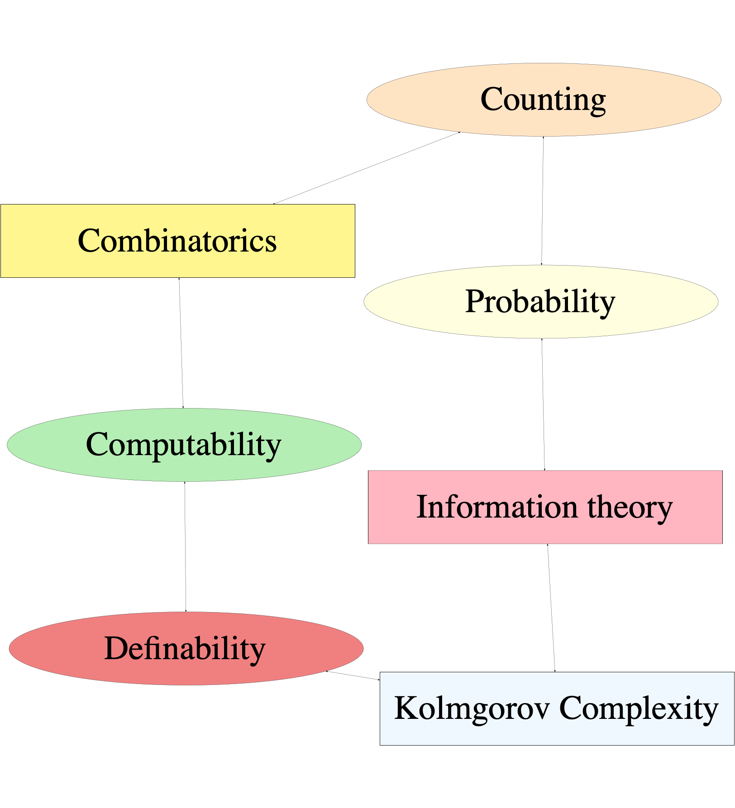
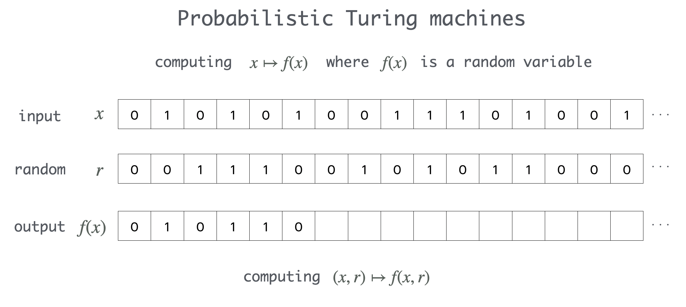
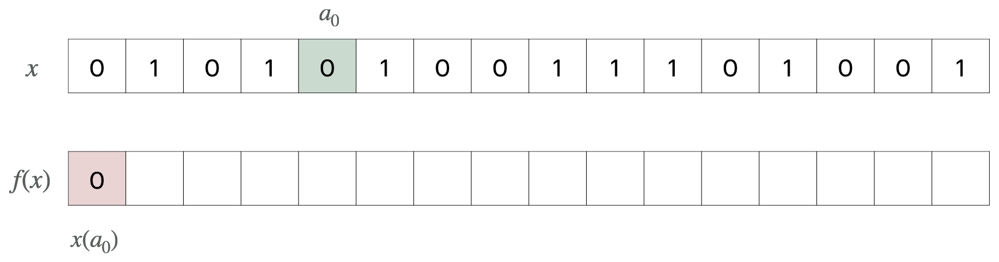
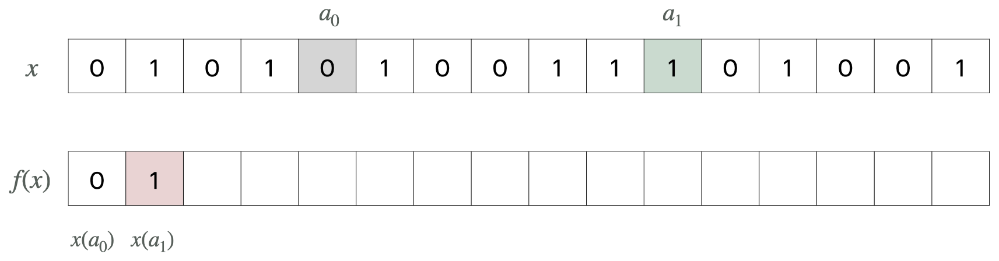
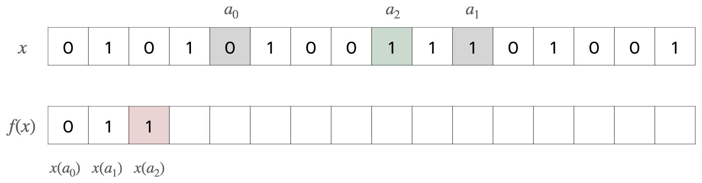
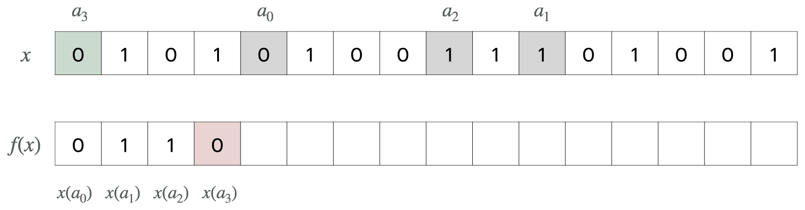
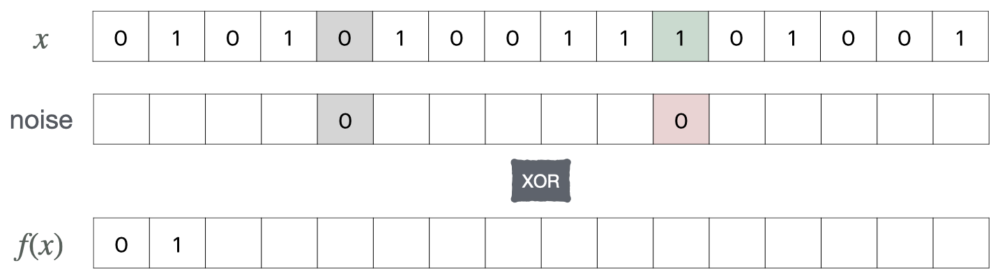

title: Games, maps and randomness
author: George Barmpalias 
coauthors: NanKai, October 2025
affiliation: Chinese Academy of Sciences
---
frozen

---
references

### Overview 

1. Games and randomness
	- Allocations and Tree-embeddings 
	- Enumeration games
	- Applications to algorithmic information

2. Inversions of functions 
	- Types of inversion and hardness
	- Degrees of unsolvability of inversions
	- Oneway functions and their strength

3.  Progress and problems

---

## Games with strings

<box>

The prefix $\preceq$ relation $\twomel$, $\omel$ gives them a tree structure.

- $\twomel$ is the set of binary strings
- $\omel$ is the set of strings natural numbers

The weight of a set $Q$ of strings is given by 

$$\sum_{\sigma\in Q} 2^{-|\sigma|}.$$

A set of strings is prefix-free if no string in it is a prefix of another one.

</box>

<box>

- $\Pone$ denotes player 1
- $\Ptwo$ denotes player 2

</box>

---
iframe

<iframe src="./img/html/KC10.html" width="110%" height="95%" frameBorder="0"></iframe>

---

## Kraft game (binary)

<box>

**Offline game**
- $\Pone$ picks a sequence $n_i, i < k $ of numbers with $\sum_{i< k} 2^{-n_i}\leq c$
- $\Ptwo$  needs to pick an antichain $\sigma_i, i< k$ in $\twomel$ with $|\sigma_i|=n_i$

</box>

$\Ptwo$ has a winning-strategy iff $c\leq 1$.

<box>

**Onine game**. At each stage s:

- $\Pone$ produces a number $n_s$ such that $\sum_{i\leq s} 2^{-n_i}\leq c$
- $\Ptwo$ produces $\sigma_s$ with $|\sigma_s|=n_s$ and $\sigma_i, i\leq s$ is an antichain.

</box>

$\Ptwo$ has a winning-strategy iff $c\leq 1$.

---

## Kraft Tree-games 

<box>
	
Requests for strings have a tree-structure.

</box>

A <g>splice-map</g> is a  map from $Q\subseteq\twomel$ to $S\subseteq\omel$ which is 

<box>

length-preserving and order preserving.

</box>

In this case we say that $Q$ is a <g>splice</g> of $S$ and 

- the $\sigma\in Q$ that map to $\tau\in S$ are <g>copies</g> of $\tau$ in $Q$.

<box>
	
<g>Weak embeddings</g> of $S\subseteq \omel$ in $\twomel$ that preserve length. 

</box>
	
---

## Kraft Tree-game 

<box>

**Offline**

- $\Pone$ picks $S\subseteq\omega^{<\omega}$ of weight $\leq w$
- $\Ptwo$ has to give a splice of $S$ in $\twomel$.

</box>

<box>

**Online**

Players enumerate $S\subseteq\omel$, $Q\subseteq\twomel$: at each stage s:

- $\Pone$ enumerates $S\subseteq\omega^{<\omega}$ of weight $\leq w$.
- $\Ptwo$ needs to maintain a splice $Q$ of $S$ in $\twomel$.

$\Ptwo$ wins $Q$ is a splice of $S$.

</box>

---

<thm>
In the Kraft tree game, $\Ptwo$ has a winning strategy iff $w\leq 1$.	
</thm>

**Information  measures** assign a complexity value to each string.

<exc>

- Kolmogorov complexity  (universal but incomputable)
- Time-bounded Kolmogorov complexity (computable).

</exc>

<thmc>
If $I$ is a computable information measure, for every $x$ there is:

- an algorithmically random real $z$ which computes $x$
- the first $I_n(x)$ bits of $z$ determine the first $n$ bits of $x$.

If $I$ is  computably enumerable $I_n(x)+\log n$ bits of $z$ suffice for $x\restr_n$.

</thmc>

---

##  Kraft Tree-game variations

<box>

- dynamically <g>restricted space</g> for $\Ptwo$
- dynamic <g>shrinking</g> of the strings of $\Pone$

</box>

These correspond to results for:

<box>

- coding into algorithmically <g>random reals</g>
- compressing down to the information content for (noncomputable) <g>enumerable information measures</g>

</box>

---

## Disk game: collisions

- tight-coding: $n$-bits to $n$-bits
- every prefix of each string is coded
- contaminated space but we allow $O(1)$ collisions
- list-decoding

---
iframe

<iframe src="./img/html/spread5.html" width="900" height="750" frameBorder="0"></iframe>

---
iframe

<iframe src="./img/html/best-disk1.html" width="900" height="750" frameBorder="0"></iframe>

---

## Enumeration games

<box>

In each round:

- $\Pone$ picks $k$ numbers  
- $\Ptwo$ picks an even number between the min and max of the $k$ numbers. 

Both choices are without repetition:

- $\Pone$ cannot choose a number that he has chosen in previous stages
- $\Ptwo$ cannot choose a number that he has chosen in previous stages.

</box>

<box>

**Winning condition** 

- $\Pone$ wins at a stage where $\Ptwo$ is unable to make a move 
- $\Ptwo$ wins if he has a legitimate move at each stage.

</box>

**Who wins?** This is open for $k>3$. 

---
iframe

<iframe src="./img/html/even-demo.html" width="1000" height="1000" frameBorder="0"></iframe>

---
references

## References for games

<pur>Allocation games</pur>

- Game interpretation of Kolmogorov complexity. <gw>Muchnik et al.</gw> 
- The Kraft-Barmpalias-Lewis-Pye Lemma revisited. <gw>A. Shen</gw> 
- Compression of data streams to their information. <gw>Barmpalias & Lewis-Pye.</gw> 
- Optimal redundancy in computations from random oracles. <gw>Barmpalias & Lewis-Pye</gw>. 
- Compression of enumerations and gain. <gw>Barmpalias, Zhang, Zhan</gw>.

<pur>Martingale games</pur>

- Granularity of wagers in games and the possibility of savings. <gw>Barmpalias, Fang</gw>.
- Monotonous betting strategies in warped casinos. <gw>Barmpalias, Fang, Lewis-Pye</gw>.
- Irreducibility of enumerable betting strategies. <gw>Barmpalias & Liu.</gw>

---

## Hardness of inverting functions

<box>
	
The security of modern cryptographic protocols is based on the (assumed) <g>hardness</g> of certain computational problems.

</box>

Central in computational complexity is the notion of <g>oneway functions</g>:

<box>
	
finite maps that are easy to compute but <r>hard to invert</r>.

</box>

Oneway functions are used to make security protocols hard to break (hash maps).

<box>	
	
Their existence is <r>unknown</r>: fundamental problem in computational complexity and modern cryptography.

</box>
	
Levin (2022) extended oneway maps to the reals and asked whether they exist.

---

## Effective functions on the reals

This is a standard notion in <g>computable analysis</g> due to Turing (1936).

<box>
	
Computability of real functions is <g>effective continuity</g>:

- computable real functions are continuous
- every continuous real function is computable in some oracle

</box>

---

## Probability and measure

Uniform measure on $2^{\omega}$ or Lebesgue measure on $[0,1]$.

A set of reals is <g>positive</g> if it has positive measure.

<box>
	
A function is <g>positive</g> is it maps every positive set to a positive set.

</box>

A property holds <g>almost everywhere</g> if it holds on a set of measure 1.

<box>
	
A a property $P$ of functions holds <g>for almost all functions</g> in a given class $\mathcal{C}$ if 
for almost all $w$ the property holds for all $g\leq_T w$ in $\mathcal{C}$.

</box>

<g>Properties of interest:</g> total, surjective, injective, collision-resistant.

---

## Inversions and Collisions

<box>

We say that $g$ <g>inverts $f$ on $y$</g> if $f(g(y))= y$.

</box>

If <g>$I_g$</g> is the set of reals where $g$ inverts $f$ we say that:

- $g$  <g>fully</g> inverts $f$ if $I_g= f(\twome)$
- $g$ <g>positively</g> inverts $f$ if $I_g$ or $f\inv(I_g)$ is positive.

<box>
$f$ is <g>effectively invertible</g> on $y$ if $y$ computes a member of $f\inv(y)$.
</box>

We say that $g$ computes an <g>$f$-collision</g> on $x$ if $f(x)=f(g(z))$.

---

## Complexity of inversion

There is no degree bound, even for total functions.

<thmc>
There is a total computable positive surjection $f$
which has no continuous full inversion.
</thmc>

Total computable *injections* have computable inverses.

<propc>
If a total computable $f$ is injective on $R$ then $f:R\to 2^{\omega}$ is effectively invertible.
</propc>

Inversion-hardness from <r>non-injectivity</r> and <r>partiality</r> (domain complexity).

---

## Oneway functions and collision-resistance

<box>
<r>Avoid:</r> functions that map all positive sets to null sets do not qualify.	
</box>	

<defic>
A positive partial computable function $f$ is 
<g>oneway</g> if almost all functions fail to invert $f$ almost everywhere.
</defic>

- <g>Collision-resistance</g> is hardness of computing collisions
- <r>Avoid:</r> functions that are injective on a positive set.

<defic>
We say $f$ is <g>collision-resistant</g> if it is almost nowhere injective
and almost all functions fail to compute $f$-collisions almost everywhere:

$$\textrm{$f(x)\neq f(h(x))$ for almost all $h, x$ with $h(x)\neq x$.}$$	

</defic>

	
---

## Oneway and degrees of unsolvability

<box>
$f$ is oneway iff $f(g(y))\neq y$ for almost all functions $g$ and reals $y$.
</box>

<box>
<g>Zero-one law.</g> If $f$ is not oneway then:
	
- almost all oracles can invert $f$ on almost all $y$.
- almost all oracles can compute a positive inversion of $f$.

</box>

Non-oneway maps are almost everywhere constant up to degree:

<box>

- <r>not oneway</r>: $f(x)\oplus z \equiv_T x\oplus z$ for almost all $z$, $x$
- <r>not $0'$-oneway</r>: $f(x)'\oplus z \equiv_T x'\oplus z$ for almost all $z, x$

</box>

---

## Oneway and algorithmic randomness

<box>
A real is random if it is not a member of any null definable $G_\delta$ set.
</box>

The choice of definability determines the strength of the randomness notion.

Randomness with respect to $\Pi^0_2$ sets suffices for us.

<defic> 
Say $f$ is <g>random-preserving</g> if $f(x)$ is random for each random $x$.
</defic>

<propc> 
A partial computable $f$ is positive iff it is random-preserving.
</propc>

---

## Randomized computations

Randomized computations can occasionally be replaced by deterministic ones.

---

## Probabilistic inversions and collisions 

Given  $f, g:\subseteq 2^{\omega}\to 2^{\omega}$ we say that $g$ is a
**probabilistic** inversion of $f$ if 

$$\hspace{0.1cm}\mu(\sqbrad{(y,r)}{f(g(y,r))=y})>0$$

A partial computable random-preserving function $f$ is 
- oneway if it has no effective probabilistic inversion.
- collision-resistant if no  $(x,z)$ with $f(x)=f(z)$ is probabilistically computable.

<propc>
The following are equivalent:

- almost all oracles compute a positive inversion of $f$
- there is an effective probabilistic inversion of $f$.
</propc>

---

## Existence of oneway functions

A partial shuffle of the input bits based on an enumeration of $0'$ is oneway.

<thmc>
There is a total <g>linear-time</g> computable oneway surjection $f$ 
such that any probabilistic inversion of $f$ computes $0'$.
</thmc>

The unused bits in a shuffle make collisions easy to find, probabilistically.

<thm>
There is a total <g>poly-time</g> computable collision-resistant oneway surjection.
</thm>

Collision-resistance is achieved by effective perturbation of the output (hashing).

<box>
<g>Ko and Friedman</g> (1980s): Time complexity for real functions.
</box>

---

## Strength of oneway - <g>new results</g>

Gauged by the oracles that probabilistically invert them.

<thmc>
If $f$ is a positive partial computable function then

- $f$ has a <g>positive</g> inversion <r>$g\leq_T 0''$</r> (not optimal) 
- if $f$ is <g>total</g> it has a positive inversion <r>$g\leq_T 0'$</r> (optimal)

</thmc>

<thmc>
If $f$ is a positive partial computable function then

- $f$ has a <g>probabilistic</g> inversion <r>$g\leq_T 0'$</r> (optimal) 
- if $f$ is <g>injective</g> it has an <r>effective</r> positive inversion. 

</thmc>
	
<box>
	
The maximum <g>strength</g> of total and partial oneway functions is $0'$.

</box>

---

## Positive inversions  harder than probabilistic 

<propc>
There is a partial computable $f:\subseteq\twome\to\twome$  which is 

- positive and nowhere effectively invertible 
- a.e. probabilistically invertible.

</propc>

Oracle $0''$ can positively invert every positive effective $f$ but  <r>$0'$ cannot</r>:

<box>
There is an effective positive $f$ which is probabilistically 
invertible but has no positive inversion $\leq_T 0'$:
restrict $x\oplus z\mapsto z$ to a complex positive $\Pi^0_2$ class.
</box>

<r>Classify</r> the complexity of positive inversions: I <r>think</r> close to $0'$ <g>(in-progress:)</g>.

---

## Our oneway is a shuffle

A <g>shuffle</g> $f:\twome\to\twome$ is given by a computable injection $(a_i)\in\omega^{\omega}$  and
$$
f(x)(i):=x(a_i).
$$

---
frozen

## Shuffle maps on the reals

A <g>shuffle</g> $f:\twome\to\twome$ is given by a computable injection $(a_i)\in\omega^{\omega}$  and
$$
f(x)(i):=x(a_i).
$$

---
frozen

## Shuffle maps on the reals

A <g>shuffle</g> $f:\twome\to\twome$ is given by a computable injection $(a_i)\in\omega^{\omega}$  and
$$
f(x)(i):=x(a_i).
$$

---
frozen

## Shuffle maps on the reals

A <g>shuffle</g> $f:\twome\to\twome$ is given by a computable injection $(a_i)\in\omega^{\omega}$  and
$$
f(x)(i):=x(a_i).
$$

---
frozen

## Shuffle maps on the reals

A <g>shuffle</g> $f:\twome\to\twome$ is given by a computable injection $(a_i)\in\omega^{\omega}$  and
$$
f(x)(i):=x(a_i).
$$

---
frozen

## Shuffle maps on the reals

Let $(a_i)$ be a computable enumeration of a noncomputable set.

<factc> 
The $(a_i)$-shuffle has the following properties: 

- it is a total computable positive surjection
- strongly non-injective
	- all inverse images are uncountable 
	- <r>every</r> injective restriction of it has null domain
- every probabilistic inversion of it computes $\sqbrad{a_i}{i\in\omega}$.

</factc>

Take $(a_i)$ be a computable enumeration of $0'$.

---

## Hashing the shuffles

The idea is to XOR the shuffle output with "random" bits.

<defic>
A <gb>hash-shuffle</gb> $f:\twome\to\twome$ is given by
$$
f(x)(i):=x(a_i)\otimes \texttt{noise}(i)
$$
where $(a_i)$ is a computable enumeration  of $A$ without repetitions.
</defic>

---
frozen

## Hashing the shuffles

The idea is to XOR the shuffle output with "random" bits.

<defic>
A <gb>hash-shuffle</gb> $f:\twome\to\twome$ is given by
$$
f(x)(i):=x(a_i)\otimes  \texttt{noise}(i)
$$
where $(a_i)$ is a computable enumeration  of $A$ without repetitions.
</defic>

---
frozen

## Hashing the shuffles

The idea is to XOR the shuffle output with "random" bits.

<defic>
A <gb>hash-shuffle</gb> $f:\twome\to\twome$ is given by
$$
f(x)(i):=x(a_i)\otimes  \texttt{noise}(i)
$$
where $(a_i)$ is a computable enumeration  of $A$ without repetitions.
</defic>

---
frozen

## Hashing the shuffles

The idea is to XOR the shuffle output with "random" bits.

<defic>
A <gb>hash-shuffle</gb> $f:\twome\to\twome$ is given by
$$
f(x)(i):=x(a_i)\otimes  \texttt{noise}(i)
$$
where $(a_i)$ is a computable enumeration  of $A$ without repetitions.
</defic>

---
frozen

## Hashing the shuffles

The idea is to XOR the shuffle output with "random" bits.

<defic>
A <gb>hash-shuffle</gb> $f:\twome\to\twome$ is given by
$$
f(x)(i):=x(a_i)\otimes  \texttt{noise}(i)
$$
where $(a_i)$ is a computable enumeration  of $A$ without repetitions.
</defic>

---
references

## References for oneway functions

- Zermelo-Fraenkel Axioms, Internal Classes, External Sets - Levin <ref>ArXiv 2209.07497</ref> 
- Computable oneway functions on the reals - <ref>Arxiv 2406.15817</ref>
- Complexity of inversion of functions on the reals - <ref>Arxiv 2412.07592</ref>
- Collision-resistant hash-shuffles on the reals  -  <ref>Arxiv 2501.02604</ref>

